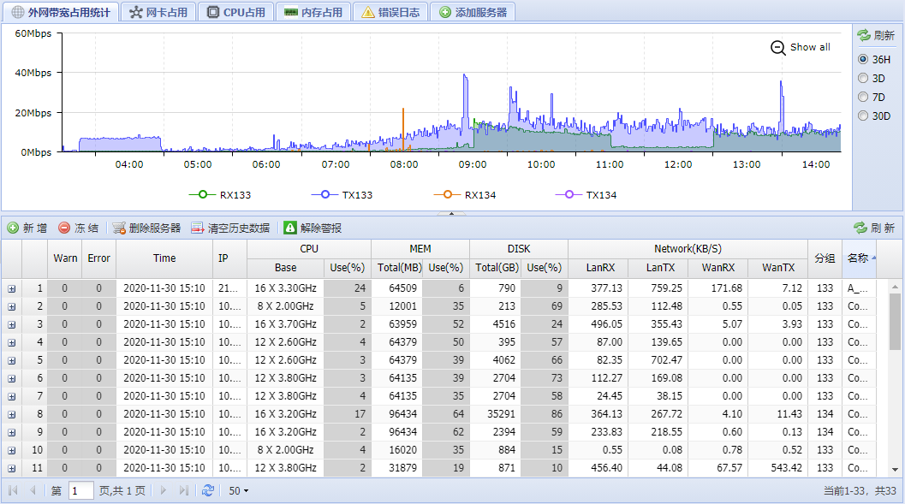
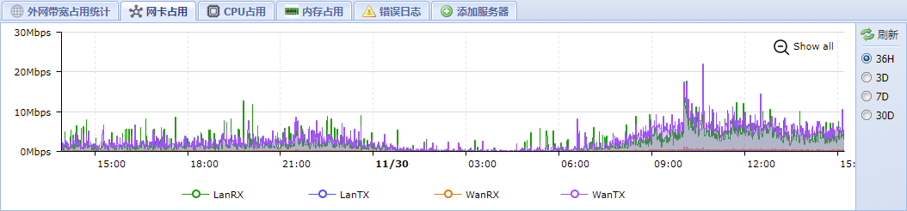
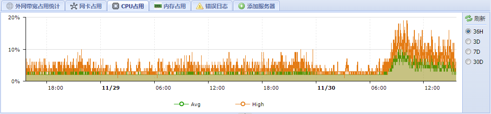
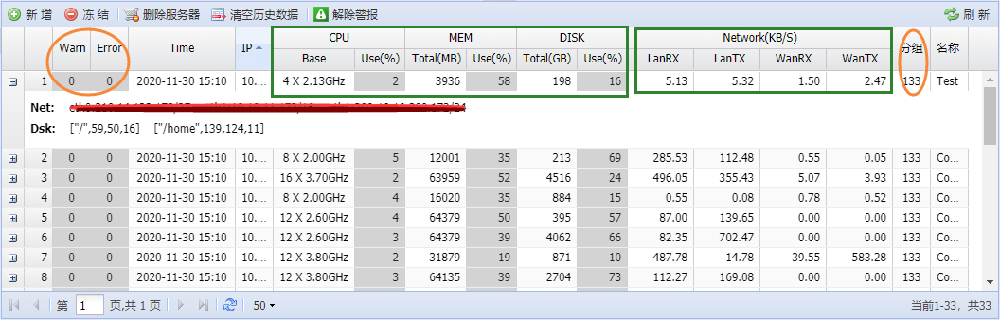

# n-sentinel-view
这是服务器监控工具 **[n-sentinel]** 的可视化管理后台；目前用`ExtJS`实现。

Client：[n-sentinel-client](https://github.com/qinchende/n-sentinel-client)

Server：[n-sentinel-server](https://github.com/qinchende/n-sentinel-server)

ManagerPages：[n-sentinel-view](https://github.com/qinchende/n-sentinel-view)

**这一块需要更多的整理，先放几张预览效果图**

### 整体管理界面

- 能看到所有服务器列表
- 可以对服务器自定义分组，Server端会按照分组汇总外网的带宽
- 显示每台服务器`CPU、MEM、DISK`基本信息和内外网网卡的流入流出带宽
- 可选历史时间段查看服务器状态数据

### 某台服务器的网卡带宽走势

### 某台服务器的CPU占用率

### 服务器监控和报警

定时统计单台服务器的信息，某项值达到预设的阈值上限将触发日志记录，在列表中会标出。Server段可以配置短信通道，会给管理员发送相应的运维短信。

